# Leareng

Leareng is an app created to learn foreign language by method similar to flashcard learning method.
This is repo with frontend code. Repo with backend code you can find [here](https://github.com/talcia/leareng-backend)

## Table of contest

-   General info
-   Technologies
-   Functionality overview
-   Project screenshots

## General info

Leareng is an app created to learn foreign language by method similar to flashcard learning method. The applications is based on playing units and serning points by correctly translating words into another language. This app is a good choice for people looking to expand their foreign language vocabulary through interactive learning.

I created this app to use it to improve my language skills as well as to learn React and Node.

Demo available [here](https://leareng.netlify.app/)

The app is deployed on netlify. The API is hosted on heroku and available [here](https://leareng.herokuapp.com/)

## Technologies

### Frontend

-   React
-   Redux
-   React-router
-   CSS (flexbox)

### Backend

-   Nodejs
-   Express
-   Jest
-   Mailgun
-   MongoDB
-   AWS S3

## Functionality overview

### New user

-   singup with name, email and password
-   login with email, password
-   confirm email by link sent to email
-   change password by link sent to email
-   update user's name and upload avatar

### Logged and confirmed user

-   check other user's details (name, avatar, created units)
-   add own unit (title, fromLang, toLang, private/public)
-   delete and edit own unit
-   add words and their translations to own unit
-   remove words and their translations from own unit
-   check own units details (words, fromLang, toLang, title, numbers of likes)
-   check public units details (words, fromLang, toLang, title, creator, numbers of likes)
-   add units created by other users to favourite
-   search public units by key words
-   search public units by specific fromLang and toLang
-   play own units and public units created by other users

### Functionality related to game

-   choose numebr of words in single game (words choose randomly from specific unit)
-   choose fromLang and toLang in which words will be displayed and translate in single game
-   translate words given in every flashcard in single game
-   check statistic after each game (points scored,right and wrong answers)

### To Do

-   word difficulty updated based on correct and bad translations of the given word
-   spaced repetition method (newly introduced and more difficult flashcards are shown more frequently)
-   friends lists
-   wall with friends statistic
-   tracking daily learning

## Project screenshots

Here is some screenshots of app in 1920x1080 resultion and on mobile.

-   Login page

  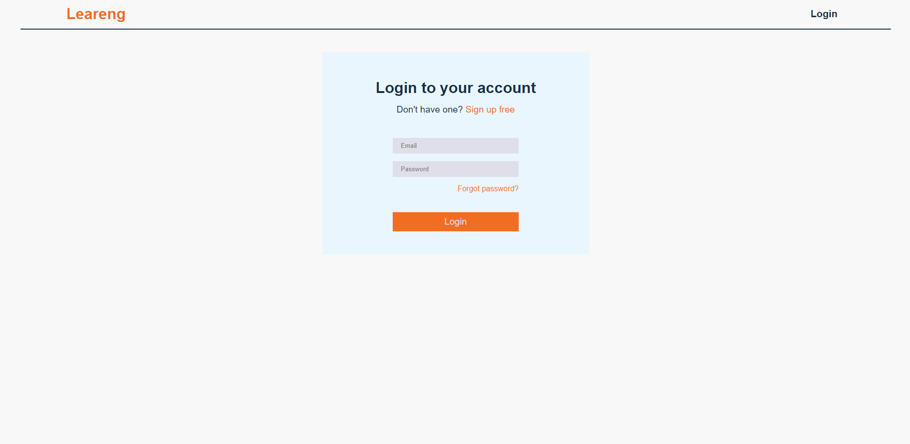
  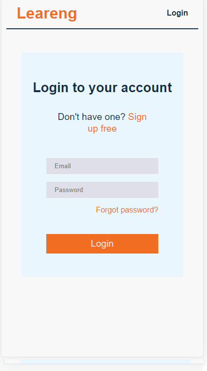

-   Signup page

  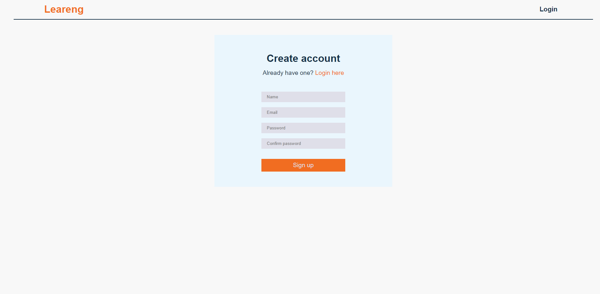
  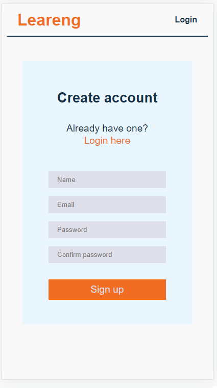

-   Add unit page

  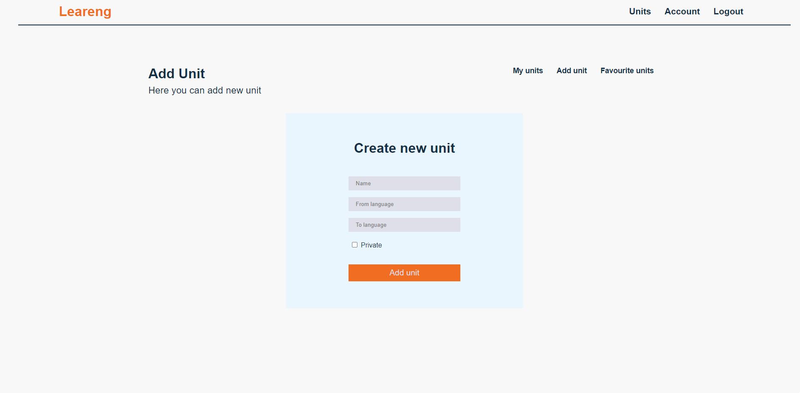
  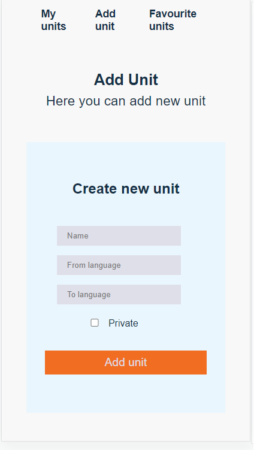

-   Own units page

  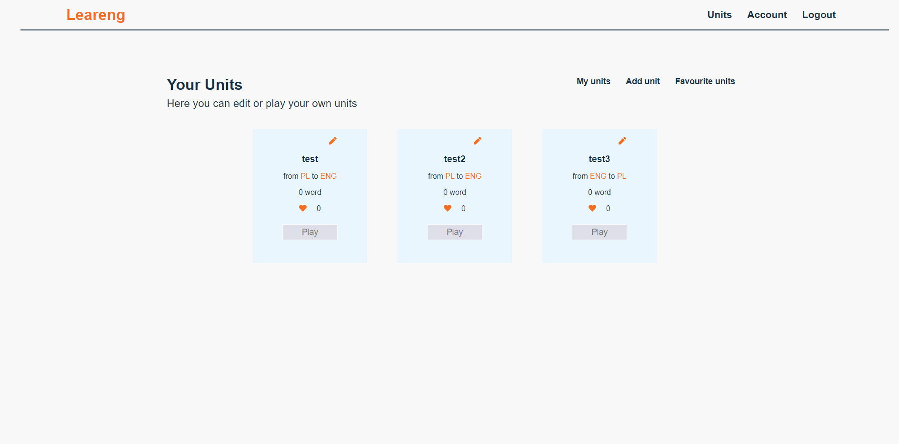
  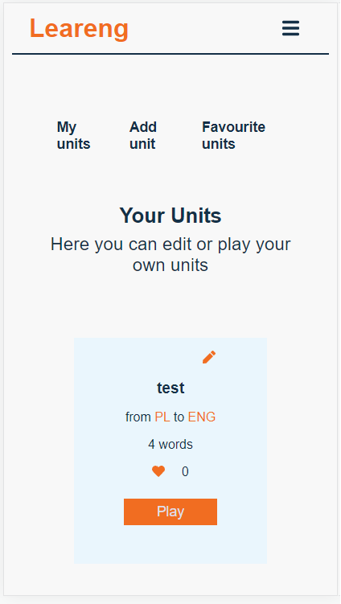

-   Unit details page

  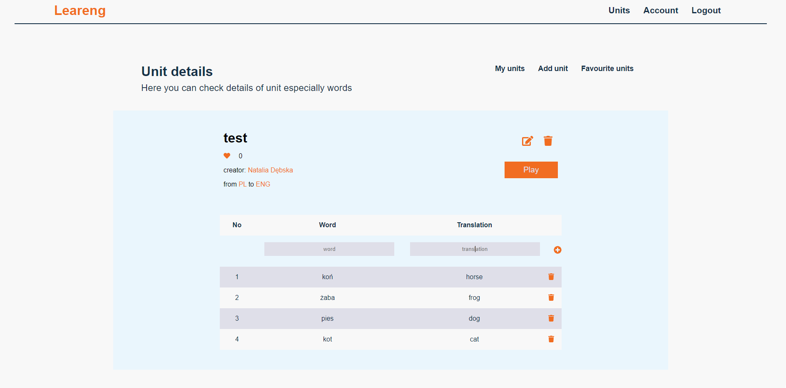
  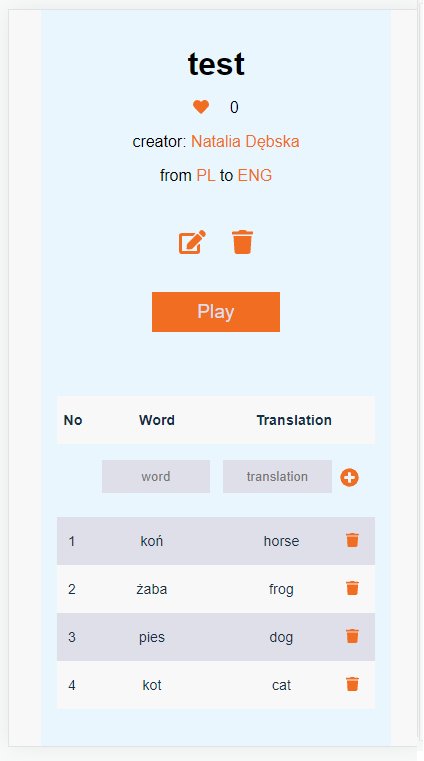

-   Game settings page

  
  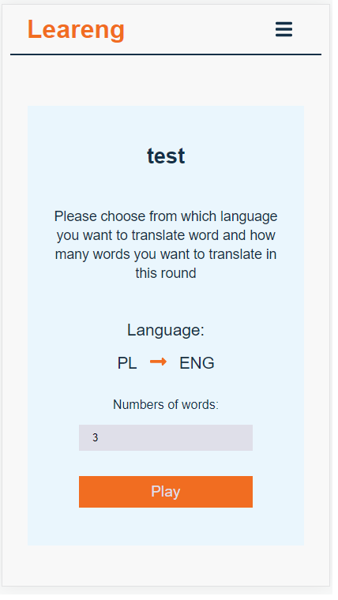

-   Game page

  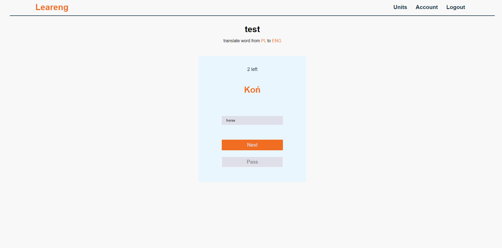
  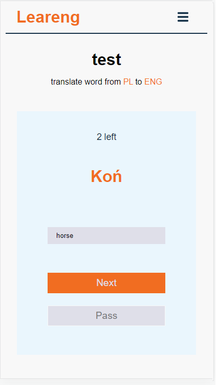

-   End of game page

  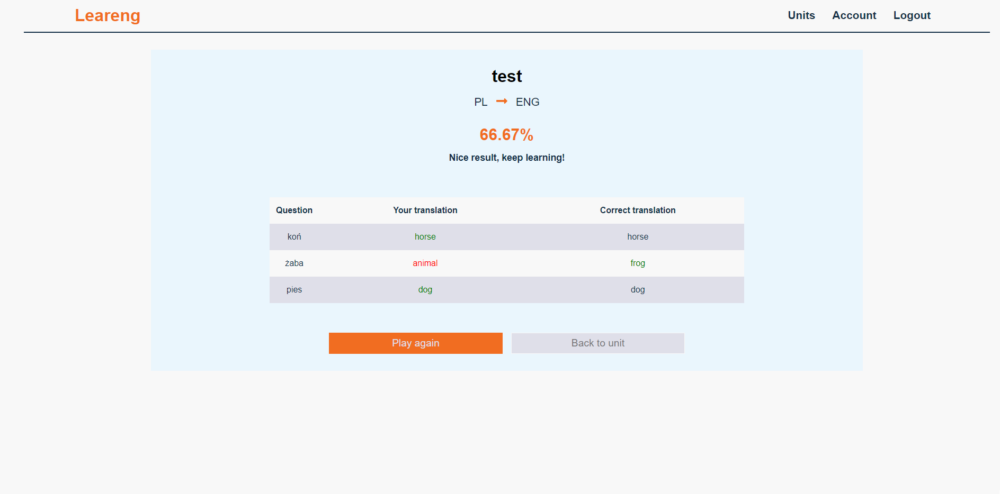
  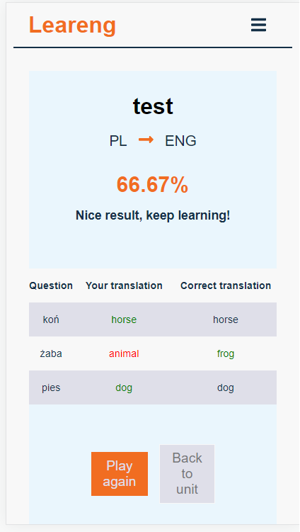

